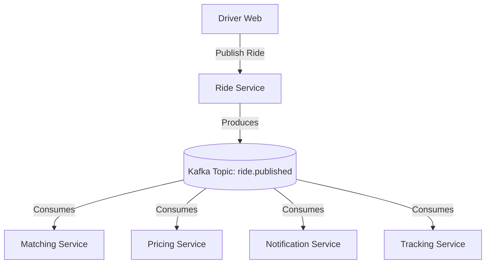

# RideSync

Firstly i just want to tell it is distributed system which made of 13 microservices so i dont have the idea how to deploy all the 13 backend microservices and how they communicate in servers after deploying  on server because its not a monolith its 13 microservices you can run fully the proper functionning on your own system and it will run perfectly fine and have deployed only frontend user-service whereyou can see the the project but its not connnected to backend becuase it has 13 microservices i dont know how to deploy 13 and and with proper communication with docker container so button are not clickable because it connnect to docker container and 13 microservices so if you want to see you can run in your system all 13 microservices with simple command "npm run dev" it will work perfectly fine and i m still learning how to deploy multiple microservices with proper communication with each other and with docker container if someone know this deployment please tell me i want to deploy that Thankyou for this reading and help.

### Distributed • Scheduled • Transparent Carpooling Platform (High Throughput and Low Latency)

RideSync is a modern, distributed carpooling platform designed to connect people traveling the same route. It allows verified drivers to publish scheduled rides, and passengers to reserve seats transparently. 

The goal? Share the ride, share the cost, reduce traffic, and lower emissions without compromising on the user experience.

---

## What is Carpooling?

Imagine four people traveling from Delhi to Gurgaon. 

Instead of four different cars traveling on the same route, one driver can take other passengers who are heading in the exact same direction. 

If the trip costs around ₹100 in total, sharing the ride significantly reduces the cost per passenger. It also means fewer vehicles on the road, lower fuel consumption, and lower CO₂ emissions. 

RideSync is built around this simple idea:
for better understanding watch this demo of why carpooling and what carpooling solves and what my carpooling solves : https://6a4413b53b15586c8a690d07--userwebcarpool.netlify.app/

**Share the ride → Share the cost → Reduce traffic → Reduce emissions.**

---

## Why I Built RideSync

The goal of this project was not just to build another standard CRUD carpooling application. 

The objective was to understand how a real production-grade distributed system works when:

- Thousands or millions of users are using it concurrently.
- Many passengers try to reserve the same seats simultaneously.
- Multiple services need to react to the same events.
- Services can fail independently.
- Latency strictly matters.
- The state of a ride changes continuously.
- The system demands high availability and fault tolerance.

RideSync was engineered strictly around:
**Scalability, Low Latency, High Throughput, Fault Tolerance, Observability, Reliability, and Transparency.**

---

## Core Idea — Transparent Pricing

RideSync follows a completely transparent pricing model. The passenger sees the exact breakdown of the fare instead of a hidden, arbitrarily surged final price.

- **Driver** → 92%
- **Platform** → 8%

The fare is dynamically distributed among confirmed passengers. For example:
- **1 passenger** → Pays the full share
- **2 passengers** → Fare divided between 2
- **3 passengers** → Fare divided between 3
- **4 passengers** → Fare divided between 4

---

## Architecture

RideSync is built as a highly decoupled **Distributed Microservices Architecture**. Each service owns a specific responsibility, and together they operate as one unified application.

### Backend Services (13 Microservices):
1. **API Gateway**: Routes traffic and handles core request validation.
2. **Auth Service**: Manages JWT authentication and user sessions.
3. **User Service**: Handles passenger profiles and preferences.
4. **Driver Service**: Manages driver verification and details.
5. **Vehicle Service**: Manages driver fleets and vehicle specifications.
6. **Ride Service**: Core service for publishing and managing the ride lifecycle.
7. **Booking Service**: Handles distributed seat reservations.
8. **Pricing Service**: Calculates dynamic, transparent fares.
9. **Matching Service**: Identifies suitable rides based on location and time.
10. **Payment Service**: Orchestrates post-ride payments.
11. **Notification Service**: Manages alerts and real-time updates.
12. **Tracking Service**: Tracks live locations and route progression.
13. **AutoShift Service**: Rescues passengers automatically in case of vehicle breakdown.

### Frontend Applications:
- **Driver Web**
- **User Web**
- **Admin Web**

---

## Technology Stack

The platform is powered by a robust, production-grade technology stack:

- **Node.js & Express.js**
- **React** (Vite, TailwindCSS, Framer Motion)
- **TypeScript**
- **Apache Kafka**
- **RabbitMQ**
- **Redis**
- **Cassandra**
- **Docker & Docker Compose**
- **Mapbox** (Routing and Geocoding)
- **WebSockets** (Socket.io for real-time updates)

---

## Kafka — Event-Driven Architecture

In a platform with millions of users, directly calling one microservice from another for every operation drastically increases tight coupling, latency, and system load.

Instead, RideSync utilizes an **Event-Driven Architecture** powered by **Apache Kafka**.

When a driver publishes a ride, the **Ride Service** doesn't directly call the Tracking or Pricing services. It simply produces an event: `ride.published` to a Kafka topic.

Multiple independent consumers can then consume this same event at their own pace:
- **Pricing Service** (calculates initial estimates)
- **Matching Service** (indexes the ride for search)
- **Notification Service** (alerts users looking for that route)
- **Tracking Service** (prepares live tracking session)

Because Kafka stores the event, if a new service is introduced later, it can independently consume the topic and process historical events according to its consumer offset and retention policies. This allows the platform to evolve without breaking existing flows.



---

## RabbitMQ

While Kafka handles event streaming, **RabbitMQ** is used specifically where the system needs reliable background job/task processing.

Examples include:
- Sending emails and push notifications.
- Payment processing and retry workflows.
- Background tasks that don't require persistent event history.

**The clear distinction:**
- **Kafka**: Event streaming, multiple consumers, event-driven choreography.
- **RabbitMQ**: Task queues, background jobs, reliable task execution.

---

## Redis

Redis is heavily utilized across the platform for low-latency operations:
- **Distributed Locking**: For concurrent seat reservations.
- **GeoSearch**: For finding nearby drivers rapidly.
- **Caching**: For frequently accessed data.
- **Real-time State**: Temporary, high-velocity ride information.

---

## Feature 1 — Distributed Seat Reservation

One of the major engineering problems solved in RideSync is concurrent overbooking.

Suppose a ride has **4 available seats**. Multiple passengers might click "Reserve Seat" at almost exactly the same millisecond. 

Without concurrency control: User A sees 1 seat, User B sees 1 seat, User C sees 1 seat. All of them could accidentally reserve the same physical seat.

**The Solution: Redis Distributed Lock.**

**Flow:**
1. Passenger clicks Reserve Seat.
2. Booking Service acquires a **Redis Distributed Lock** tied specifically to that ride/seat.
3. Checks seat availability.
4. Reserves the seat and persists the state.
5. Publishes a reservation event.
6. Releases the lock.

Because Redis is incredibly fast, this lock adds negligible latency. The lock also has an expiration (TTL) so a crashed microservice process does not hold the lock forever.

---

## Why I Avoided Payment During Reservation

Traditional systems follow this flow: **Reserve → Pay → Cancel → Refund.**

This creates immense, unnecessary payment and refund complexity. RideSync uses a different approach:

**Reserve Seat (No upfront payment)** → **Driver starts the ride** → **Payment is initiated** → **Fare is calculated and divided according to confirmed passengers.**

If a passenger cancels *before* the ride starts, there is zero payment that needs to be refunded. 
This design decision avoids the refund problem entirely rather than trying to optimize slow refunds. It significantly improves user experience, payment flow simplicity, system throughput, and latency.

---

## Feature 2 — AutoShift Service

This is one of the key features I designed for RideSync.

A scheduled carpool ride can sometimes fail mid-journey due to engine failure, a tyre puncture, or an accident. The passengers still need to reach their destination without unnecessary delays or paying double fares.

**Flow:**
1. Ride is in progress and a vehicle problem occurs.
2. Tracking/Ride service detects the issue and emits an AutoShift event.
3. **AutoShift Service** kicks in.
4. Uses **Redis GeoSearch** to instantly find nearby available drivers based on latitude/longitude.
5. Selects a suitable driver and sends an immediate notification.
6. Driver accepts, passengers are seamlessly shifted, and the ride continues.

Redis GeoSearch searches within a small radius (e.g., 5 km) and dynamically expands if required. The replacement driver reaches the passengers quickly, and the platform handles the complexity—passengers are not charged an additional fare.

---

## Scheduled Carpooling

Rides on RideSync are primarily scheduled. A driver can publish:
- Source and Destination
- Route via Mapbox
- Pickup and Departure times
- Vehicle and Available seats

Passengers can filter and find matching rides specifically based on their required route and scheduled pickup time.

---

## Matching & Pricing Services

- **Matching Service**: Helps identify suitable rides based on source, destination, pickup time, route compatibility, and available seats. 
- **Pricing Service**: Strictly handles fare calculation based on distance, base fare, per-kilometre pricing, and the number of currently confirmed passengers.

---

## Saga Pattern & Idempotency

- **Saga Pattern**: Distributed transactions across microservices cannot rely on a single ACID database transaction. For workflows involving multiple services (like completing a ride and initiating payments), RideSync uses the Saga pattern. If one step fails, the system executes compensating actions to roll back the state globally.
- **Idempotency**: Implemented to prevent duplicate processing. Whether it's a duplicate booking request from a lagging UI, a duplicate payment event, or a retried Kafka delivery, the system ensures the same operation does not accidentally create duplicate business effects.

---

## Observability & Fault Tolerance

The backend is not a black box. I designed the system with production-oriented observability to understand exactly what is happening under load:
- Structured Logging
- Distributed Monitoring & Metrics
- Error tracking and Service Health checks
- Kafka Producer/Consumer logs

**Fault Tolerance mechanisms include:**
- Completely independent microservices.
- Kafka event durability.
- RabbitMQ retry and dead-letter queues.
- Redis locks with TTL.
- Saga compensating actions.
- Idempotent event processors.

---

## Database Strategy: Cassandra

**Apache Cassandra** is used as the distributed persistent database where heavy, reliable writes are required (like Ride History and core state).

It fits the project perfectly due to:
- Decentralized, distributed architecture.
- Horizontal scalability.
- High availability and fault tolerance.
- Capability to handle large write volumes efficiently.

*Redis handles high-velocity temporary state, but Cassandra is the permanent source of truth.*

**Ride History:**
Historical records are never physically deleted. A ride transitions properly through statuses:
`UPCOMING` → `ONGOING` → `COMPLETED` 
(or `EXPIRED` / `CANCELLED`).

---

## Project Highlights
- High Throughput and Low Latency (By using Message Queues like Kafka and RabbitMQ)
- Distributed microservices architecture
- Event-driven communication with Apache Kafka
- Background task processing with RabbitMQ
- Redis distributed locking for concurrent seat reservation
- Redis GeoSearch for AutoShift driver replacement
- Transparent, dynamic pricing algorithm
- Scheduled route-based carpooling
- Distributed transactions using the Saga pattern
- Idempotent event processing
- Cassandra-based distributed persistence
- Production-oriented observability
- Fault tolerance and high scalability

---

## Project Structure

```text
ride/
├── apps/                 # Frontend Applications
│   ├── admin-web/        # React + Vite Admin Dashboard
│   ├── driver-web/       # React + Vite Driver Portal
│   └── user-web/         # React + Vite Passenger Portal
├── services/             # Backend Microservices
│   ├── api-gateway/      
│   ├── auth-service/     
│   ├── autoshift-service/
│   ├── booking-service/  
│   ├── driver-service/   
│   ├── matching-service/ 
│   ├── notification-service/
│   ├── payment-service/  
│   ├── pricing-service/  
│   ├── ride-service/     
│   ├── tracking-service/ 
│   ├── user-service/     
│   └── vehicle-service/  
├── packages/             # Shared Types and Utilities
├── docker-compose.yml    # Infrastructure configuration
└── package.json          # Root workspace configuration
```

---

## Run Locally

### Prerequisites
- Node.js (v18+)
- Docker and Docker Compose
- Mapbox API Key

### Infrastructure Setup
Start the underlying infrastructure (Kafka, Zookeeper, RabbitMQ, Redis, Cassandra) using Docker:

```bash
docker-compose up -d
```

### Services Setup
Install dependencies from the root directory (utilizing NPM workspaces):

```bash
npm install
```

Start all microservices and frontends simultaneously:

```bash
npm run dev
```

Ensure that your `.env` files are properly configured for each service based on the provided `.env.example`.

---

## Design Philosophy

*I wasn't trying to build a demo that simply works on my laptop.* 

I wanted to deeply understand what happens when a system is under actual load, when microservices fail unexpectedly, when multiple users perform the exact same operation at the same millisecond, and when the platform absolutely needs to remain available i mean simply production grade Distributed System.

RideSync is the result of that curiosity a platform built to handle the chaos of distributed systems while providing a clean, transparent, and seamless experience for the end user.
